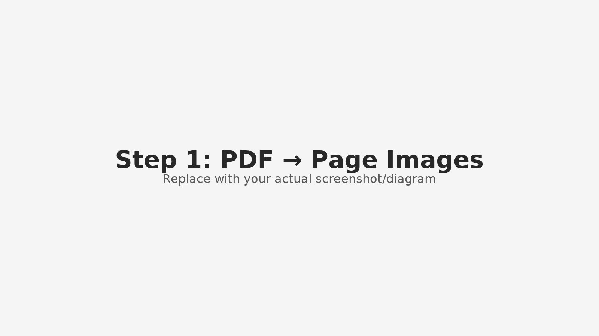
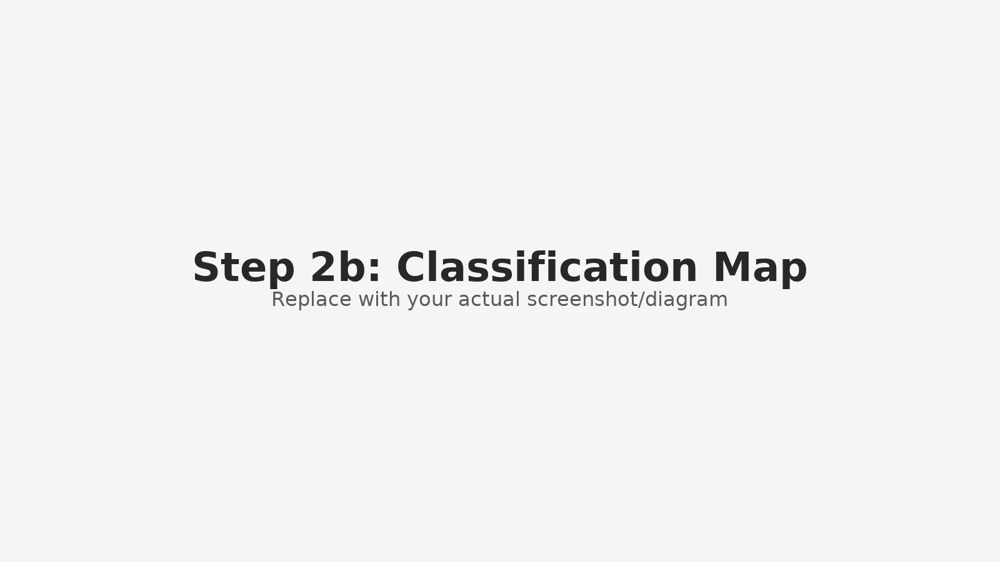
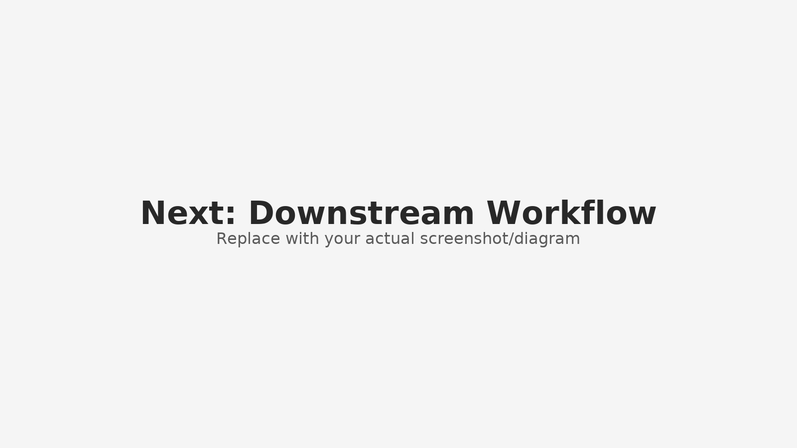

# Legal Document Pipeline (Visual Walkthrough)

bunch of text here

  
   
  <i>1. A PDF is decomposed into individual pages.</i>

bunch of text here

  
   
  <i>2. Each page image is sent to the AI for classification.</i>

  
   
  <i>3. The AI maps page numbers to document types.</i>

  <i>4. A structured spreadsheet output is generated.</i>

| Filename | Category | Exhibit Label | Exhibit Title | Notes | Footnote | Block Quote |
|----------|----------|---------------|---------------|-------|----------|-------------|
| page_0001.png | Pleading first page | | | page_0001_caption.txt | | |
| page_0002.png | Table of Contents | | | page_0002_TOC.txt | | |
| page_0003.png | Pleading body | | | | Y | |
| page_0004.png | Pleading body | | | | | Y |
| page_0005.png | Exhibit cover page | A | Dismissal Letter | | | |
| page_0007.png | Exhibit content | A | | | | |
| page_0008.png | Proof of service page | | | | | |

  <em>Classification results showing document structure and metadata extraction</em>

  
   
  <i>5. The pipeline continues: TOC parsing, indexing, retrieval.</i>

---

### Swap in your actual images

Replace each file in `/images` with your real screenshots/diagrams, keeping the same names:
- `images/pdf_split.png`
- `images/classification_basic3.png` (export from your SVG to PNG for reliability)
- `images/classification_map.png` (export your .drawio to PNG)
- `images/spreadsheets.png`
- `images/workflow.png`

(*GitHub renders PNGs more consistently than SVGs*.)

