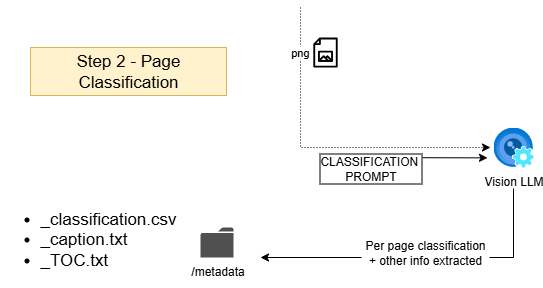

# Legal Document Pipeline (Visual Walkthrough)

bunch of text here

  
   
  <i>1. A PDF is decomposed into individual pages.</i>

bunch of text here

  
   
  <i>2. Each page image is sent to the AI for classification.</i>

| Filename | Category | Exhibit Label | Exhibit Title | Notes | Footnote | Block Quote |
|----------|----------|---------------|---------------|-------|----------|-------------|
| page_0001.png | Pleading first page | | | page_0001_caption.txt | | |
| page_0002.png | Table of Contents | | | page_0002_TOC.txt | | |
| page_0003.png | Pleading body | | | | Y | |
| page_0004.png | Pleading body | | | | | Y |
| page_0005.png | Exhibit cover page | A | Dismissal Letter | | | |
| page_0007.png | Exhibit content | A | | | | |
| page_0008.png | Proof of service page | | | | | |

  <em>Classification results showing document structure and metadata extraction</em>

  

    
  

  

    <h4>Extracted Document Metadata</h4>
    <pre style="background-color: #f6f8fa; padding: 15px; border-radius: 6px; font-size: 12px; overflow-x: auto;">
{
  "document_title": "Defendants' Memorandum of Points and Authorities in Support of Demurrer to Third Amended Complaint [Notice of Demurrer, Statement of Demurrer, Request for Judicial Notice, and Declaration of Nathaniel P. Garrett Filed Concurrently Herewith]",
  "filing_date": "03/17/2022",
  "filing_party": "Defendants",
  "named_plaintiffs": [
    "Glenn Mahler", "James H. Poole", "Julie Conger", "Edward M. Lacy Jr.",
    "William S. Lebov", "John C. Minney", "John Sapunor"
  ],
  "named_defendants": [
    "Judicial Council of California", "Chief Justice Tani G. Cantil-Sakauye", "Does One through Ten"
  ],
  "filing_attorneys": [
    {
      "name": "Robert A. Naeve",
      "bar_number": "106095",
      "email": "rnaeve@jonesday.com",
      "firm": "Jones Day",
      "address": "3161 Michelson Drive, Suite 800, Irvine, California 92612",
      "telephone": "+1.949.851.3939",
      "facsimile": "+1.949.553.7539",
      "party_represented": "Defendants"
    }
  ],
  "court": "Superior Court of the State of California, County of San Francisco",
  "case_number": "CGC-19-575842",
  "judge": "Hon. Richard B. Ulmer Jr.",
  "department": "302",
  "hearing_time": "9:30 a.m.",
  "hearing_date": "April 12, 2022"
}
    </pre>
    
<em>AI-extracted structured data from the document's first page</em>

  

  
   
  <i>3. The AI maps page numbers to document types.</i>

  <i>4. A structured spreadsheet output is generated.</i>

  
   
  <i>5. The pipeline continues: TOC parsing, indexing, retrieval.</i>

  
   
  <i>5. Footnotes are moved inline so they aren't detached from the in-body reference point during chunking.</i>

---

### Swap in your actual images

Replace each file in `/images` with your real screenshots/diagrams, keeping the same names:
- `images/pdf_split.png`
- `images/classification_basic3.png` (export from your SVG to PNG for reliability)
- `images/classification_map.png` (export your .drawio to PNG)
- `images/spreadsheets.png`
- `images/workflow.png`

(*GitHub renders PNGs more consistently than SVGs*.)

