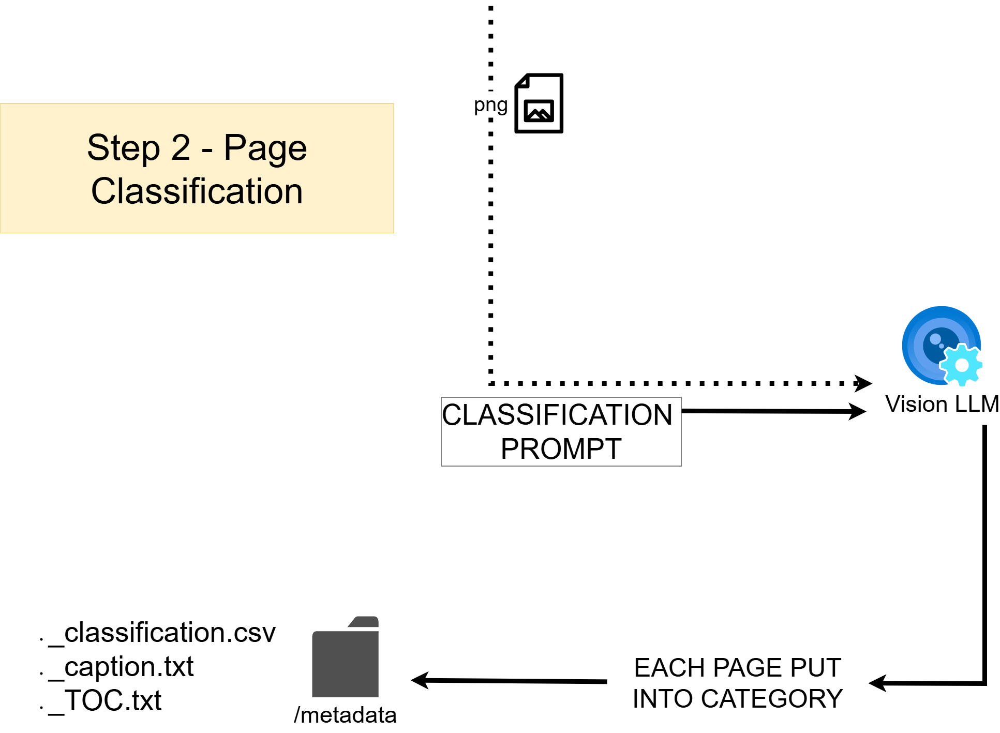

# Legal Document RAG Pipeline

## Objective
Pre-processes litigation filings into contextually tagged chunks for attorney use in a RAG repository.

---

### Objective - Chunk Example


---

## Purpose
Standard RAG systems don't work well for legal documents because they ignore context. The same text means different things depending on whether it's in a complaint vs. a motion, the main argument vs. an exhibit, or plaintiff's allegation vs. defendant's characterization. When it was filed and by whom matters.

This system extracts and embeds in each chunk the minimum background knowledge a litigator would need to make sense of that chunk independently: what document it's from, which part, who filed it and when, and what argument section it belongs to. Each chunk becomes a self-contained unit with enough context for useful legal retrieval.

[→ More on the thinking behind the app](#why-standard-rag-fails-for-legal-work)

---

## Pipeline Overview


### Key Steps:
1. **Extract**: PDF → (PNG images + .txt); remove line numbers
2. **Classify**: Each page typed (pleading body, exhibit, TOC, etc.) via GPT-5-mini vision
3. **Structure**: Extract doc and case info from caption page; TOC and section headings; exhibit labels
4. **Clean up** *(under construction)*: Minor formatting, move footnotes inline and tag, tag block quotes
5. **Chunk**: Smart splitting respecting document structure and token limits
6. **Output**: Organized and named files/folders + JSONL with searchable chunks

---

## Pipeline Mechanics

### 1. PDF Decomposition


- **Input**: PDF litigation filings
- **Process**: PyMuPDF extraction at 300 DPI (or other local PDF tools like Acrobat, ABBYY)
- **Output**: 
  - `PNG/page_XXXX.png` - High-quality page images
  - `text_pages/page_XXXX.txt` - OCR'd text with line numbers removed
  - `metadata/` - (empty until classification step)

### 2. Page Classification (Critical Step)



Using GPT-5-mini vision model, each page is classified:

| Category | Description |
|----------|-------------|
| Pleading first page | Identifies document metadata |
| Table of contents | Used for chunking |
| Table of authorities |  
| Pleading body | Main legal arguments |
| Exhibit cover/content | Labelled and titled |
| Court form |
| Proof of service |

### 3. Metadata Extraction
#### Caption Page Extraction
If a page is classified as "pleading first page", basic case information is extracted:
- **Document title** - From caption page
- **Party Names**
- **Filing date** - From court stamps
- **Filing party** - Simplified (plaintiff, defendant, etc.)
- **Filing Attorney** 


##### Example: Caption page processing


#### TOC structure
The TOC is converted from visual layout to structured markdown. This hashtag hierarhy is later mapped onto headers in the pleading body pages, which allows them to be chunked by argument section instead of page or tokens.

##### Example: TOC Extraction and Processing
 

#### Exhibit ID'ing and Labeling
- **Exhibit labels** - A, B, 1, 2, etc.

### 4. Text Cleanup *(under construction)*
- Footnotes are tagged [FN(3)]...footnote text...[FN(3)_end] and moved into the body of the text. This prevents 
- Block quotes are tagged [Block_quote] because formatting losses make them difficult to spot.  
- Additional formatting cleanup

### 5. Chunking

#### For Documents WITH Table of Contents:
- Match TOC entries to body headings
- Map TOC structure to markdown hierarchy
- Inject hierarchy (###) markers in headings in OCR'd .txt files
- Organize chunks by section with TOC metadata
- Purpose: attribute pieces of text to argument organization

#### For Documents WITHOUT Table of Contents:
- Smart page combining based on:
  - Token limits (500-800 default)
  - Sentence boundaries
  - Exhibit boundaries
  - Structural markers
 
#### 6. Final Chunk Format
The app is designed to take this input and convert it into the chunks below.


Chunks are outputted in JSON containers:
```json
[
  {
    "document_title": "DEFENDANTS' MEMORANDUM OF POINTS AND AUTHORITIES IN SUPPORT OF DEMURRER TO FIRST AMENDED COMPLAINT",
    "filing_party": "Defendants",
    "filing_date": "2024-03-15",
    "section_path": "BACKGROUND / A. Plaintiffs’ Factual Allegations",
    "chunk_ID": 14,
    "document_ID": 54,
    "page_numbers": [8,9],
    "exhibit_label": null,
    "exhibit_title": null,
    "page_type": "pleading_body",
    "text": "[PDF_page_8_cont.] A. Plaintiffs’ Factual Allegations.\n\nPlaintiffs challenge recent changes to the TAJP implemented by Defendants, the Judicial\nCouncil of California and Chief Justice Tani G. Cantil-Sakauye. FAC ¶ 1.\n\nArticle VI, section 6(e) of the California Constitution provides that the Chief Justice \"shall\nseek to expedite judicial business and to equalize the work of judges,\" and \"may provide for the\nassignment of any judge to another court … with the judge’s consent.\" FAC ¶ 3 (quoting Cal.\nConst. art. VI, § 6(e)). Section 6(e) provides that \"[a] retired judge who consents may be\nassigned to any court.\" Id.\n\nAccording to the FAC, the TAJP establishes the structure by which the Chief Justice\n\"temporarily assigns retired judges to fill judicial vacancies and to cover for vacations, illnesses,\ndisqualification and other absences.\" FAC ¶ 2. To be eligible to participate in the TAJP, a retired\njudge must not have been defeated in an election for office, must not have been removed from\n\n[PDF_page_9] MEM. OF P. & A. IN SUPP. OF DEMURRER\n\noffice by the Commission on Judicial Performance, and must have met minimum age and years-\nof-service requirements. Id. ¶ 4 (citing Gov’t Code § 75025). To remain in the program, a retired\njudge must, at a minimum, \"serve at least 25 days each fiscal year.\" Id. ¶ 5. Plaintiffs allege that\nuntil May 21, 2018, there was no maximum limit on the number of days a retired judge could\nparticipate in the TAJP. Id. ¶ 7."
  },
  {
    "document_title": "DEFENDANTS' MEMORANDUM OF POINTS AND AUTHORITIES IN SUPPORT OF DEMURRER TO FIRST AMENDED COMPLAINT",
    "filing_party": "Defendants",
    "filing_date": "2024-03-15",
    "section_path": "BACKGROUND / A. Plaintiffs’ Factual Allegations",
    "chunk_ID": 15,
    "document_ID": 54,
    "page_numbers": [9],
    "exhibit_label": null,
    "exhibit_title": null,
    "page_type": "pleading_body",
    "text": "[PDF_page_9_cont] On May 21, 2018, Defendants limited the number of days a retired judge can participate in\nthe TAJP to 1,320-service days. FAC ¶ 7. The FAC alleges that all plaintiffs have already\naccumulated over 1,320-service days in the program. Id. ¶¶ 8-16.\n\nAccording to Plaintiffs, the 1,320-day service limit prevents them from participating in the\nTAJP under the same terms and conditions “as are applicable to younger judges.\" FAC ¶ 16.\nThey allege that the 1,320-day service limit “has a disparate impact on plaintiffs and other\npersons of their age\" because they \"will no longer be given assignments unless they receive an\n'exception' to the policy.\" Id. ¶ 24. Plaintiffs summarily allege the 1,320-day service limit “does\nnot apply to younger, more recently retired judges.\" Id. ¶ 26.\n\nThe FAC states two causes of action. Count One alleges unlawful disparate impact age\ndiscrimination in violation of the FEHA. FAC ¶ 30. Count Two alleges \"Violation of the\nCalifornia Constitution,\" claiming that the 1,320-day service limit violates sections 6(d) and 6(e)\nof article VI of the California Constitution. Id. ¶¶ 33-34. Plaintiffs seek \"back pay, front pay,\nand other monetary relief,\" as well as declaratory and injunctive relief. See FAC at Prayer for\nRelief."
  }
]
```

### 5. Output Structure
```
[Document_Name]/
├── PNG/                 # Page images
├── text_pages/          # Extracted text
├── metadata/            
│   ├── chunks.jsonl     # All chunks with metadata
|   ├── [doc]_classification.csv    # Page types
│   ├── page_XXXX_caption.txt       # Document metadata
│   └── page_XXXX_TOC.txt           # Table of contents
└── chunks/              
    └── chunk_XXXX.txt   # Individual chunk files
```


```

---

## Usage

### Requirements
- Python 3.9+
- OpenAI API key (set as `OPENAI_API_KEY` environment variable)

### Installation
```bash
git clone [repository]
cd legal-rag-pipeline
pip install -r requirements.txt
```

### Basic Usage
```bash
# Place PDFs in the PDFs/ folder, then:
python pipeline.py

# For CSV updates only:
python pipeline.py --update-mode --csv-type output
```

### Scripts

# Legal Document Processing Pipeline

This repository contains a suite of Python scripts designed to process, classify, and analyze legal documents. The pipeline automates the extraction of text and images from PDFs, classifies document pages using AI, standardizes naming conventions, and chunks documents for further analysis.

## Pipeline Scripts

| Script | Purpose | Notes |
| --- | --- | --- |
| `00_pipeline_orchestrator.py` | Main orchestrator - runs the entire pipeline. | Entry point. |
| `01_prompt_repository.py` | Stores all prompts for classification and vision models. | Required by the classifier. |
| `10_pdf_extractor.py` | Extracts each page of a PDF as both a PNG image and cleaned text. | First step in the pipeline. |
| `11_document_classifier.py` | Classifies pages of documents using GPT-5 vision. | This is the most critical step. |
| `20_toc_formatter.py` | Cleans and structures the Table of Contents for later chunking. | This is essential for documents with a Table of Contents. |
| `21_metadata_aggregator.py` | Pulls together file info for tracking and creates `output.csv`. | |
| `22_folder_standardizer.py` | Standardizes folder names for legal documents and creates `standardized.csv`. | Won't change folder names if unnecessary |
| `23_data_synchronizer.py` | Detects changes in CSV files and propagates them back to source files. | Allows for bidirectional synchronization. |
| `30_toc_chunker.py` | Chunks documents that have a Table of Contents. | Maps the markdown TOC onto OCR, then chunks. |
| `31_semantic_chunker.py` | Chunks documents that do not have a Table of Contents. | |
| `99_ocr_enhancer.py` | Uses PaddleOCR or AI visionto ID footnotes and headers/footers. | TBD - will incorporate at earlier stage |
| `id_system.py` | Manages document and chunk IDs across the pipeline. | |
| `metadata_extractor.py` | Extracts metadata from various sources like caption files and classification CSV files. | |

---

## Known Limitations

- **Classification errors**: Misidentified exhibits can cascade. Manual review recommended.
- **Cross-page content**: Headers/text breaking across pages may be split
- **Nested exhibits**: Exhibits containing other exhibits need manual handling
- **No error recovery**: Currently no automated correction after misclassification

---

## Status: Beta
This pipeline is functional but actively being refined. Contributions and bug reports welcome.

---

## Why Standard RAG Fails for Legal Work

### Index Card Analogy
Think of a RAG database as a big box of index cards. Each card is a chunk of text, and a robot—a retrieval algorithm, not an AI—compiles a small stack of cards most similar to the user's query and passes those to the AI. The robot itself is not an AI; it's dumb. It doesn't make sense of each chunk in relation to every other chunk. In fact, it doesn't even know whether two chunks are from the same document.

### The Indispensible Categories of Context
Legal arguments are nested and referential. Two chunks can look nearly identical in meaning but differ entirely in significance depending on their location in the corpus, the arguments parties have advanced, and the litigation's trajectory.

Consider: Defendant's motion summarizes plaintiff's fifth cause of action as alleged in the third amended complaint. This should not be used to understand what the fifth cause of action actually asserts, only what the defendant claims it asserts (or fails to). 

### Example - Exact same text of allegation varied with "cause of action" or defendant type
Without contextual tagging, the statement "defendant was required to timely process plaintiff's tax information" could be:
1. An allegation of duty in a negligence claim (relief: monetary damages)
2. An allegation of ministerial duty (relief: writ of mandate ordering action)

If it's negligence against a government entity, there may be immunity. If plaintiff isn't also making a mandate claim for that same act, and the government is immune for negligence, the argument might be dead. The same text, completely different legal significance.

### Design Principles
- Use AI for non-discretionary classification only
- No AI for sophisticated thinking or variable outputs  
- Traditional OCR over AI (AI overcorrects and gets lazy)
- Minimum viable context: just what a litigator needs

One could never draft a brief with a box of document snippets and a robot that can only identify thematic similarity. In working with legal documents, retrieval unmoored from context will return flotsam. Each chunk must carry the background knowledge an attorney would already have when drafting.

---

## Classification Examples
[Add classification examples]

## License
[Add license information]
