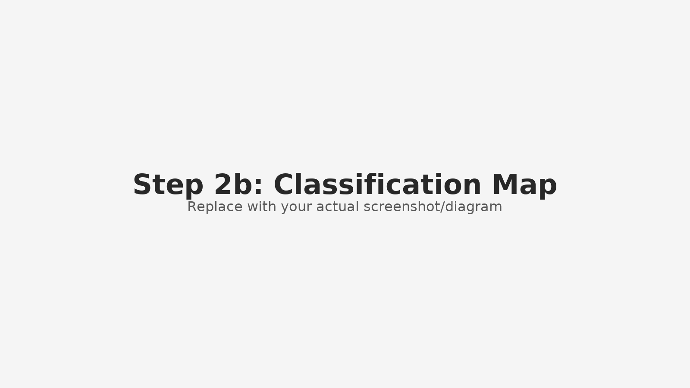

# Legal Document Pipeline (Visual Walkthrough)

  
   
  <i>1. A PDF is decomposed into individual pages.</i>

  
   
  <i>2. Each page is sent to the AI for classification.</i>

  
   
  <i>3. The AI maps page numbers to document types.</i>

  
   
  <i>4. A structured spreadsheet output is generated.</i>

  
   
  <i>5. The pipeline continues: TOC parsing, indexing, retrieval.</i>

